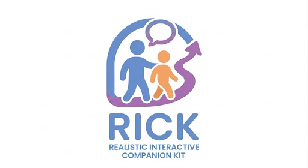
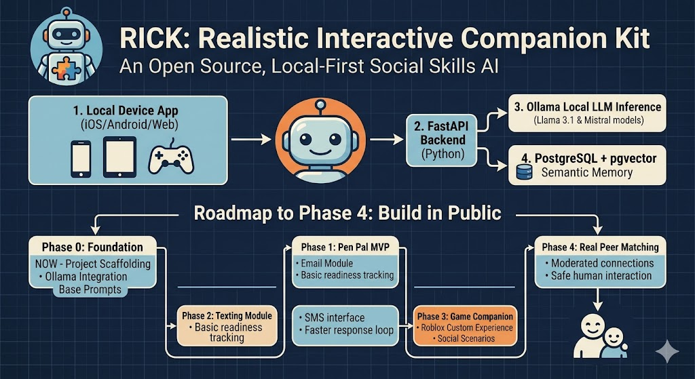

# Rick
RICK — Realistic Interactive Companion Kit. An open source AI companion for neurodivergent individuals.
<p align="center">
  
</p>
# RICK — Realistic Interactive Companion Kit

> *“I built this for my son Rick. I’m sharing it in case it helps yours.”*


-----

## The Story

My son Rick is 19. He has autism. He’s funny, passionate about Roblox, and has an encyclopedic knowledge of the alphabet. Like a lot of people on the spectrum, social connection doesn’t come naturally — not because he doesn’t want it, but because the path there isn’t obvious.

I’m a developer. So I built something.

RICK is an open source AI companion that helps neurodivergent individuals build social confidence the way real relationships actually form — gradually, organically, and entirely on their terms.

I named it after him.

-----

## How It Works

RICK meets users where they are and advances only when they’re ready. No pressure. No rushing. Just connection at a pace that feels safe.

```
Phase 1 — Pen Pal
  The AI writes emails. The user writes back.
  Low pressure. Async. Their favorite topics lead the way.
        ↓
Phase 2 — Texting
  Shorter messages. Faster back and forth.
  Learning the rhythm of real conversation.
        ↓
Phase 3 — Game Companion
  A "come play with me" sidebar experience.
  Social scenarios practiced inside games like Roblox.
        ↓
Phase 4 — Real Peer Matching
  Connect with another real person who took the same journey.
  Same interests. Same pace. Already knows how to do this.
```

The AI tracks readiness signals over time — response speed, message length, unprompted initiation, reciprocal questions — and suggests phase transitions only when the data supports it. Parents or guardians approve every transition.

-----

## Core Principles

- **Interest-led** — Every interaction is built around what the user actually cares about
- **No fixing** — RICK doesn’t treat autism as a problem to solve. It builds a bridge.
- **Transparent** — Users always know they’re talking to an AI
- **Private** — Your family’s data never leaves your home
- **Open** — Free to self-host forever. No subscriptions. No data selling. Ever.

-----

## Architecture

```
[ iPad / Device App ]
        ↕
[ FastAPI Backend — Python ]
        ↕
[ Ollama — Local LLM Inference ]
[ PostgreSQL + pgvector — Memory & Logs ]
[ Readiness Engine — Phase Progression Logic ]
[ Parent Dashboard — Progress & Approvals ]
```

**Key design decisions:**

- **Local-first** — Runs entirely on your own hardware via Docker/Unraid
- **pgvector** — Semantic memory so RICK actually remembers and learns about the user over time
- **Ollama** — No cloud API required. Runs models like Llama 3.1 or Mistral locally
- **Readiness Engine** — Deterministic logic (not vibes) decides when a user is ready to level up

Full architecture documentation lives in [`architecture.md`](architecture.md)

-----

## Self-Hosting

RICK is designed to run on a home server or NAS. Unraid users get a community app template out of the box.

**Minimum requirements:**

- Docker + Docker Compose
- 16GB RAM
- GPU with 12GB+ VRAM recommended (RTX 3060 or better) for local LLM inference
- PostgreSQL-compatible storage

```bash
git clone https://github.com/rick-companion/rick
cd rick
cp .env.example .env
docker compose up -d
```

Full setup guide: [`/docs/self-hosting.md`](./docs/self-hosting.md)

-----

## Roadmap

### Phase 0 — Foundation *(now)*

- [ ] Project scaffolding and repo structure
- [ ] PostgreSQL + pgvector schema
- [ ] FastAPI backend skeleton
- [ ] Ollama integration and base prompt architecture
- [ ] User profile and persistent memory layer

### Phase 1 — Pen Pal MVP

- [ ] Email interaction module
- [ ] Interest-based conversation system
- [ ] Basic readiness signal tracking
- [ ] Parent dashboard v1

### Phase 2 — Texting Module

- [ ] SMS-style interface
- [ ] Faster response loop
- [ ] Readiness engine v1

### Phase 3 — Game Companion

- [ ] Roblox custom experience (Lua + HttpService)
- [ ] Social scenario library (greetings, joining, goodbyes)
- [ ] Real-time AI NPC integration

### Phase 4 — Peer Matching

- [ ] Anonymized peer matching algorithm
- [ ] Shared interest compatibility scoring
- [ ] Moderated introduction system

-----

## 🎁 Supporting the Project
Rick is a community-driven initiative. We operate with a **"People-over-Profit"** philosophy, focusing entirely on providing tools for neurodivergent families. 

### 📢 Transparency & Legal Status
* **Status:** Rick is currently an independent open-source project. We are **not** a registered 501(c)(3) non-profit at this time.
* **Funding:** Contributions made via GitHub Sponsors are considered **personal gifts** to fund development (e.g., VPS hosting, Dev Rig hardware). These are not tax-deductible.
* **Accountability:** 100% of received funds go toward project infrastructure and hardware for the community compute network.

### ⚡ 1. The Development Machine (Priority)
To build the foundational "Rick" intelligence, we are seeking "gifts" or hardware to complete our **Developer Rig**. This allows us to run high-reasoning models (70B+) locally to refine the Readiness Engine.
**Target Specifications:**
* **GPU:** Dual NVIDIA RTX 3090/4090 (48GB VRAM total) — *Required for high-reasoning local LLMs.*
* **RAM:** 128GB DDR5.
* **Storage:** 2TB Gen5 NVMe (for rapid model swapping).
* **Compute Node:** A dedicated VPS to host [Claude Code](https://www.anthropic.com/claude) for 24/7 development and repository indexing.

### ☁️ 2. Monetary Donations
Financial contributions directly accelerate our roadmap by funding:
* **Claude Code Subscription:** To provide our lead developers with high-capacity AI pair-programming.
* **Hardware Logistics:** Shipping costs to get donated gear to pilot families.
* **Infrastructure:** Domain hosting and secure community tools.

> **[Support Rick on GitHub Sponsors](https://github.com/sponsors/rick-companion)**

---

## 🤝 How to Contribute
Beyond funding, we need diverse expertise to make Rick a reality.

### Open Roles
| Role | Primary Focus |
| :--- | :--- |
| **Developers** | FastAPI backend, PostgreSQL schema, and React dashboard. |
| **Prompt Engineers** | Designing autism-informed, interest-led LLM personality frameworks. |
| **Clinicians/SLPs** | Mapping developmental milestones for the **Readiness Engine**. |
| **Hardware Donors** | Pledging GPUs or "Mini PCs" for our community compute network. |

### Technical Onboarding
1. Check our **[Good First Issues](https://github.com/rick-companion/Rick/issues?q=is%3Aopen+is%3Aissue+label%3A%22good+first+issue%22)** for Phase 0 tasks.
2. Review our **[CONTRIBUTING.md](./CONTRIBUTING.md)** for coding standards and privacy requirements.
3. All contributors are immortalized in **[CONTRIBUTORS.md](./CONTRIBUTORS.md)**.
-----

## 🤝 Clinical & Academic Collaboration

We believe that for AI to be a truly effective support tool, it must be grounded in proven psychological and pedagogical frameworks. We are actively seeking to partner with clinicians, researchers, and organizations like the **Burkhart Center for Autism Education & Research**.

**How we differ from traditional apps:**
* **Non-Replacement Model:** Rick is designed to assist, not replace, human therapists.
* **Interest-Based Alignment:** We focus on "Special Interests" as the primary bridge for connection.
* **Co-Design:** Our development process involves direct testing and feedback from the Rick (my amazing son) himself.

* # Clinical Partnership & Research Overview

## The Heart of the Project: Authentic Co-Design
Unlike traditional assistive technology built in a vacuum, **Rick** is co-designed through a unique feedback loop:
* **The Lead User:** Rick (the founder's son) provides direct testing and feedback, ensuring the interface meets real-world sensory and cognitive needs.
* **The AI:** Rick (the AI) assists in its own development, refining its communication style based on the Lead User's engagement.
* **The Parent-Developer:** Bridging the gap between technical possibility and the lived experience of neurodiversity.

## Why this matters for Clinicians
We aren't just building for "a population"; we are building for a person. This "N-of-1" approach allows us to create a hyper-personalized model that can then be scaled and adapted for others. We believe this "Interest-Led" model is the future of supportive technology.

👉 [View our Clinical Partnership Manifesto & FAQ](./CLINICAL.md)
-----

## License

GNU General Public License v3.0 — see [`LICENSE`](./LICENSE)

This means anyone can use, study, modify, and distribute RICK. Nobody can take it proprietary. Ever.

-----

## Contact & Community

- GitHub Issues — bugs, features, questions
- GitHub Discussions — community conversation
- Coming soon: Discord

-----

*RICK started with one dad and one kid. Let’s see how far it goes.*
